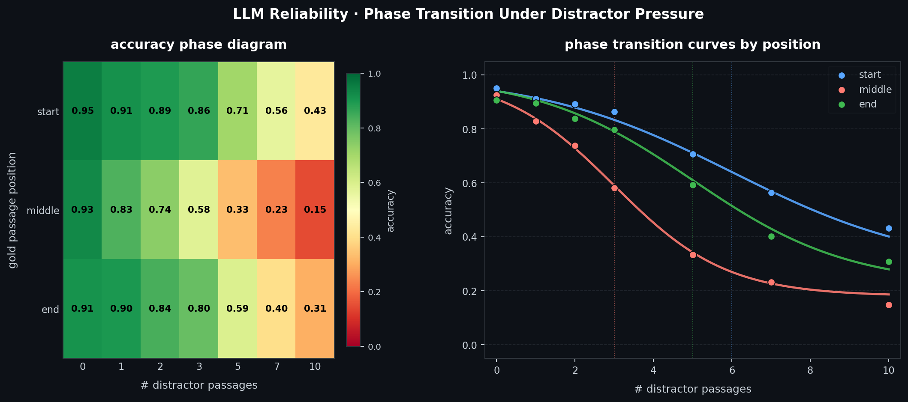

# LLM Phase Transition

Mapping where language model reliability collapses as context gets noisier — borrowing phase-transition framing from physics to describe the breakdown.

The heatmap shows accuracy as a function of distractor density × gold passage position. The curves on the right are sigmoidal — there's a sharp transition point, not a gradual linear degradation. Middle placement degrades fastest, consistent with the Lost-in-the-Middle effect.

## Notebooks

**01 — Entropy Probe**
Does first-token Shannon entropy increase when the model receives contradicting context? Main finding: poisoned context doesn't make the model uncertain — it makes it confidently wrong. Entropy drops, not spikes.

**02 — Attention & Position**
Mechanistic verification of the position effect using GPT-2 attention weights. Tracks how much attention the model pays to the gold passage depending on where it sits in the context window.

## Stack

- `transformers`, `transformer_lens`
- `torch`, `pandas`, `matplotlib`, `scipy`

## Status

Active. Phase diagram sweep and steering vector mitigation coming next.
